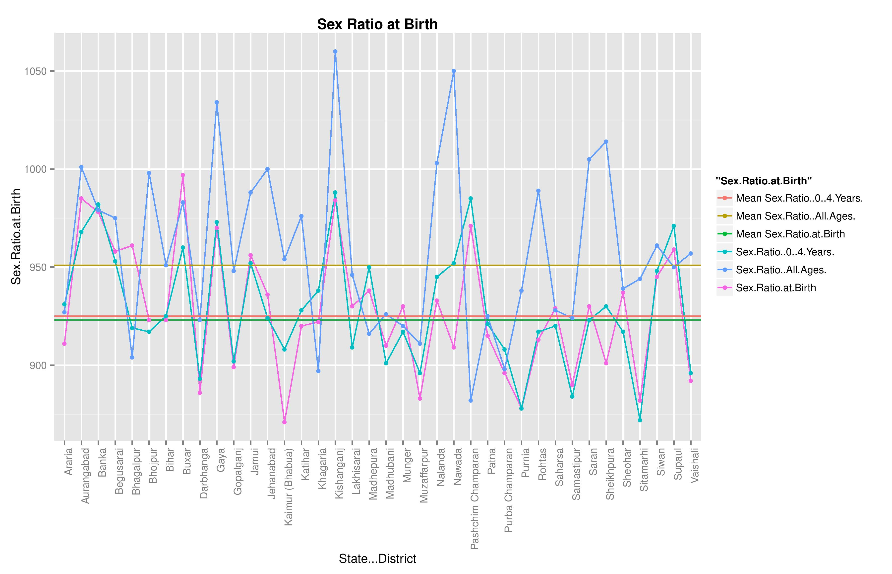
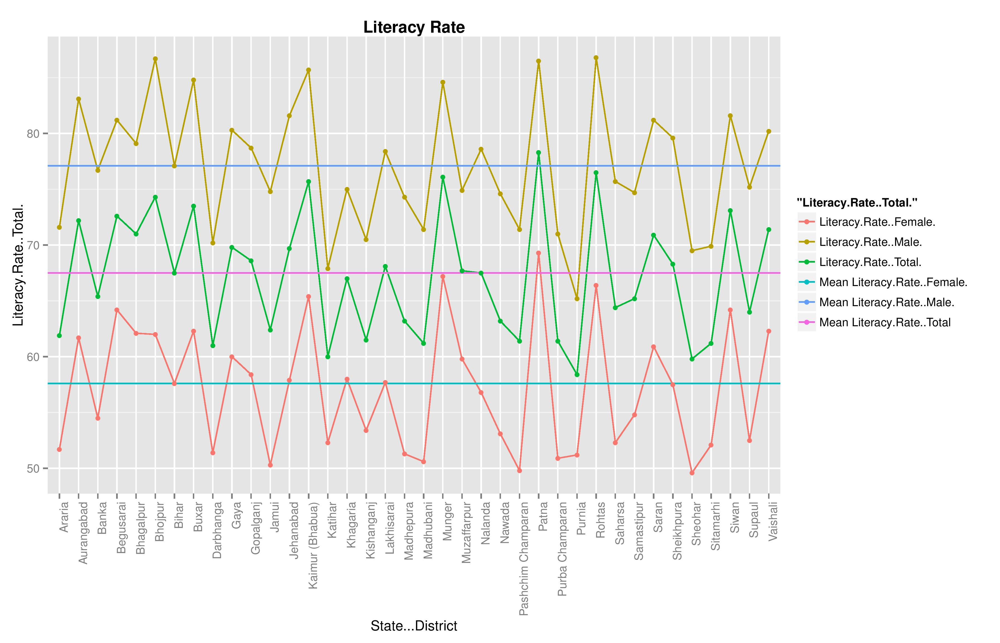

A short report on different socio-economic parameters in different districts of Bihar.

******

### Problem Statement

Elections are round the corner in the Indian State of Bihar. One of the clients of SocialCops wants to understand the level of development in different socio-economic parameters across all the districts of Bihar. Using open data, prepare an index that measures and ranks districts of Bihar on socio-economic parameters. Also prepare a short report on the output describing each of the components of the Index.

******

### Solution

Open data from various sources was collected, tidied up, processed and compiled into file `bihar_sample.xlsx` using R and Excel. After intense research and thought, 10 socio-economic parameters were selected and most of them were converted from an absolute value to percentage values in the above file. Now using R these parameters are indexed and plotted for a better understanding of socio-economic situation in different districts of Bihar.


**1.Sex Ratio**   

  The Sex ratio is the ratio of males to females in a population. The ideal sex ratio is 1:1. Due to selective terminations of pregnancy, and female infanticide this ratio has been disbalanced. Hence Government and society as a whole puts tremendous importance on the revival of a healty sex ratio and it is one of the key socio-economic paramter. Here three subparameters `Sex Ratio at Birth`, `Sex Ratio (0-4 Years)` and `Sex Ratio (All Ages)` are also considered. The scale is number of females per 1000 males.
    
  First we load the required libraries `xlsx` and `ggplot2` along with the excel file into the environment.

```{r, warning=FALSE, message=FALSE}
library(xlsx)
library(ggplot2)
bihar <- read.xlsx("bihar_sample.xlsx", sheetIndex = 1)
```

  Now we plot the line graph, code for which is given below.

```{r set-options, cache=FALSE,fig.keep='none'}
options(width = 100)
ggplot(bihar, aes(State...District,group = 1)) + 
    geom_line(aes(y = Sex.Ratio.at.Birth, colour = "Sex.Ratio.at.Birth")) + 
    geom_line(aes(y = Sex.Ratio..0..4.Years., colour = "Sex.Ratio..0..4.Years.")) + 
    geom_line(aes(y = Sex.Ratio..All.Ages., colour = "Sex.Ratio..All.Ages.")) + theme(axis.text.x = element_text(angle = 90, hjust = 1)) + geom_hline(aes(yintercept=923, colour = 'Mean Sex.Ratio.at.Birth')) + geom_hline(aes(yintercept=925, colour = 'Mean Sex.Ratio..0..4.Years.')) + geom_hline(aes(yintercept=951, colour = 'Mean Sex.Ratio..All.Ages.')) + geom_point(aes(y = Sex.Ratio.at.Birth, colour = "Sex.Ratio.at.Birth")) + geom_point(aes(y = Sex.Ratio..0..4.Years., colour = "Sex.Ratio..0..4.Years.")) + geom_point(aes(y = Sex.Ratio..All.Ages., colour = "Sex.Ratio..All.Ages.")) + ggtitle("Sex Ratio at Birth") + 
    theme(plot.title = element_text(face="bold"))
```



  To order different districts of Bihar on Sex Ratio we run following code. Here the districts are ranked as per their Sex Ratio [Higher is better]. 

```{r}
sex_ratio <- bihar[ order(-bihar[,2]), ]
sex_ratio[,1:4]
```


**2.Literacy Rate**

  Literacy Rate is the total percentage of the population of an area at a particular time aged seven years or above who can read and write with understanding. Here the denominator is the population aged seven years or more. Literacy rate is also a key factor that determines the development status of an area or district. Despite government programmes, Bihar's literacy rate increased only "sluggishly". One of the main factors contributing to this relatively low literacy rate is the lack of proper school facilities as well as the sheer inefficiency of teaching staff across the government run education sector. There is a shortage of classrooms to accommodate all the students. In addition, there is no proper sanitation in most schools. Here two subparameters are also considered `Literacy Rate (Male)` and `Literacy Rate (Female)`. The scale is in percentage.     
  
  Now we plot the line graph, code for which is given below.

```{r, fig.keep='none'}
ggplot(bihar, aes(State...District,group = 1)) + 
    geom_line(aes(y = Literacy.Rate..Total., colour = "Literacy.Rate..Total.")) + 
    geom_line(aes(y = Literacy.Rate..Male., colour = "Literacy.Rate..Male.")) + 
    geom_line(aes(y = Literacy.Rate..Female., colour = "Literacy.Rate..Female.")) + theme(axis.text.x = element_text(angle = 90, hjust = 1)) + geom_hline(aes(yintercept=67.5, colour = 'Mean Literacy.Rate..Total')) + geom_hline(aes(yintercept=77.1, colour = 'Mean Literacy.Rate..Male.')) + geom_hline(aes(yintercept=57.6, colour = 'Mean Literacy.Rate..Female.')) + ggtitle("Literacy Rate") + geom_point(aes(y = Literacy.Rate..Total., colour = "Literacy.Rate..Total.")) + geom_point(aes(y = Literacy.Rate..Male., colour = "Literacy.Rate..Male.")) + geom_point(aes(y = Literacy.Rate..Female., colour = "Literacy.Rate..Female.")) + 
    theme(plot.title = element_text(face="bold"))
```



  As we can see in the plot there is a wide gender disparity in the literacy rate in Bihar. To order different districts of Bihar on literacy rate we run following code. Here the districts are ranked as per their Literacy Rate [Higher is better].  
  

```{r}
literacy_rate <- bihar[ order(-bihar[,5]), ]
literacy_rate[,c(1,5:7)]
```

**3.Children currently attending school**

  The percentage of children currrently attending school should be as high as possible because it will promote skill development and knowledge among the children. A social parameter it reflects the presence of proper schooling infrastructure, willingness of parents to send their wards to school and general level of development in the district.        
 
  Two sub parameters have also been studied here `Children currently attending school (Age 6-17 years)(Male)` & `Children currently attending school (Age 6-17 years)(Female)` . The age of children in this dataset is 6-17 years and the scale is in percentage.      
  
  Now to analyse this social parameter we will plot the line graph, code for which is given below.

```{r, fig.keep='none'}
ggplot(bihar, aes(State...District,group = 1)) + 
    geom_line(aes(y = Children.currently.attending.school..Age.6.17.years......Total., colour = "Children.currently.attending.school..Age.6.17.years......Total.")) + 
    geom_line(aes(y = Children.currently.attending.school..Age.6.17.years......Male., colour = "Children.currently.attending.school..Age.6.17.years......Male.")) + 
    geom_line(aes(y = FemalChildren.currently.attending.school..Age.6.17.years......Female., colour = "FemalChildren.currently.attending.school..Age.6.17.years......Female.")) + theme(axis.text.x = element_text(angle = 90, hjust = 1)) + geom_hline(aes(yintercept=92.2, colour = 'Mean Children.currently.attending.school..Age.6.17.years......Total.')) + geom_hline(aes(yintercept=92.7, colour = 'Mean Children.currently.attending.school..Age.6.17.years......Male.')) + geom_hline(aes(yintercept=91.6, colour = 'Mean FemalChildren.currently.attending.school..Age.6.17.years......Female.')) + ggtitle("Children currently attending school (Age 6-17 years)") + geom_point(aes(y = Children.currently.attending.school..Age.6.17.years......Total., colour = "Children.currently.attending.school..Age.6.17.years......Total.")) + geom_point(aes(y = Children.currently.attending.school..Age.6.17.years......Male., colour = "Children.currently.attending.school..Age.6.17.years......Male.")) + geom_point(aes(y = FemalChildren.currently.attending.school..Age.6.17.years......Female., colour = "FemalChildren.currently.attending.school..Age.6.17.years......Female.")) + 
    theme(plot.title = element_text(face="bold")) + theme(legend.position = "bottom", legend.direction = "vertical")
```


  Now to order different districts of Bihar on percentage of Children currently attending school we run following code. Here the districts are ranked as per their respective percentage [Higher is better]. 


```{r}
children_school <- bihar[ order(-bihar[,8]), ]
literacy_rate[,c(1,8:10)]
```

**4.Children engaged in work**

  The percentage of children engaged in work also refferd to as *Child Labour* refers to the employment of children in any work that deprives children of their childhood, interferes with their ability to attend regular school, and that is mentally, physically, socially or morally dangerous and harmful. This practice is considered exploitative by many international organisations.Poverty is the greatest single cause behind child labour. This socio-economic parameter gives a holistic view of povert and scope of development in the district or state. Subparameters `Children aged 5-14 years engaged in work (%)(Total)(Male)` & `Children aged 5-14 years engaged in work (%)(Total)(Female)` have also been considerd. The age of children in this dataset is 5-14 years and the scale is in percentage.             
  
  Now to analyse this social parameter we will plot the line graph, code for which is given below.
    
```{r, fig.keep='none'}
ggplot(bihar, aes(State...District,group = 1)) + 
    geom_line(aes(y = Children.aged.5.14.years.engaged.in.work.....Total., colour = "Children.aged.5.14.years.engaged.in.work.....Total.")) + 
    geom_line(aes(y = Children.aged.5.14.years.engaged.in.work.....Total..Male., colour = "Children.aged.5.14.years.engaged.in.work.....Total..Male.")) + 
    geom_line(aes(y = Children.aged.5.14.years.engaged.in.work.....Total..Female., colour = "Children.aged.5.14.years.engaged.in.work.....Total..Female.")) + theme(axis.text.x = element_text(angle = 90, hjust = 1)) + geom_hline(aes(yintercept=3, colour = 'Mean Children.aged.5.14.years.engaged.in.work.....Total.')) + geom_hline(aes(yintercept=3.5, colour = 'Mean Children.aged.5.14.years.engaged.in.work.....Total..Male.')) + geom_hline(aes(yintercept=2.6, colour = 'Mean Children.aged.5.14.years.engaged.in.work.....Total..Female.')) + ggtitle("Children aged 5-14 years engaged in work (Total)") + geom_point(aes(y = Children.aged.5.14.years.engaged.in.work.....Total., colour = "Children.aged.5.14.years.engaged.in.work.....Total.")) + geom_point(aes(y = Children.aged.5.14.years.engaged.in.work.....Total..Male., colour = "Children.aged.5.14.years.engaged.in.work.....Total..Male.")) + geom_point(aes(y = Children.aged.5.14.years.engaged.in.work.....Total..Female., colour = "Children.aged.5.14.years.engaged.in.work.....Total..Female.")) + 
    theme(plot.title = element_text(face="bold")) + theme(legend.position = "bottom", legend.direction = "vertical")
```


  Now to order different districts of Bihar on percentage of Children engaged in work we run following code. Here the districts are ranked as per their respective percentage [Lower is better]. 

```{r}
children_work <- bihar[ order(bihar[,11]), ]
children_work[,c(1,11:13)]
```

**5.Prevlance of any type of disablity**

  Disability is the consequence of an impairment that may be physical, cognitive, mental, sensory, emotional, developmental, or some combination of these. A disability may be present from birth, or occur during a person's lifetime. Individuals may also qualify as disabled if they have had an impairment in the past or are seen as disabled based on a personal or group standard or norm. Such impairments may include physical, sensory, and cognitive or developmental disabilities. Mental disorders (also known as psychiatric or psychosocial disability) and various types of chronic disease may also qualify as disabilities. Prevlance of disablity is an important socio-economic parameter that reflects the status of health infrastructure, level of nutrition and number of able bodied men & women.       
  
  Subparameters `Prevalence of any type of Disability (Total)(Male)` & `Prevalence of any type of Disability (Total)(Female)` have also been examined. The scale here is number per 100,000 population.         
  
  Now to analyse this social parameter we will plot the line graph, code for which is given below.
    
```{r, fig.keep='none'}
ggplot(bihar, aes(State...District,group = 1)) + 
    geom_line(aes(y = Prevalence.of.any.type.of.Disability..Per.100.000.Population..Total., colour = "Prevalence.of.any.type.of.Disability..Per.100.000.Population..Total.")) + 
    geom_line(aes(y = Prevalence.of.any.type.of.Disability..Per.100.000.Population..Total..Male., colour = "Prevalence.of.any.type.of.Disability..Per.100.000.Population..Total..Male.")) + 
    geom_line(aes(y = Prevalence.of.any.type.of.Disability..Per.100.000.Population..Total..Female., colour = "Prevalence.of.any.type.of.Disability..Per.100.000.Population..Total..Female.")) + theme(axis.text.x = element_text(angle = 90, hjust = 1)) + geom_hline(aes(yintercept=1617, colour = 'Mean Prevalence.of.any.type.of.Disability..Per.100.000.Population..Total.')) + geom_hline(aes(yintercept=1958, colour = 'Mean Prevalence.of.any.type.of.Disability..Per.100.000.Population..Total..Male.')) + geom_hline(aes(yintercept=1262, colour = 'Mean Prevalence.of.any.type.of.Disability..Per.100.000.Population..Total..Female.')) + ggtitle("Prevalence of any type of Disability (Per 100,000 Population)(Total)") + geom_point(aes(y = Prevalence.of.any.type.of.Disability..Per.100.000.Population..Total., colour = "Prevalence.of.any.type.of.Disability..Per.100.000.Population..Total.")) + geom_point(aes(y = Prevalence.of.any.type.of.Disability..Per.100.000.Population..Total..Male., colour = "Prevalence.of.any.type.of.Disability..Per.100.000.Population..Total..Male.")) + geom_point(aes(y = Prevalence.of.any.type.of.Disability..Per.100.000.Population..Total..Female., colour = "Prevalence.of.any.type.of.Disability..Per.100.000.Population..Total..Female.")) + 
    theme(plot.title = element_text(face="bold")) + theme(legend.position = "bottom", legend.direction = "vertical")
```


  Now to order different districts of Bihar on prevlance of any type of disablity we run following code. Here the districts are ranked as per their prevlance of any type of disablity. [Lower is better].

```{r}
disablity <- bihar[ order(bihar[,14]), ]
disablity[,c(1,14:16)]
```

**6.Children Immunized** 

  Immunization is the process whereby a person is made immune or resistant to an infectious disease, typically by the administration of a vaccine. Vaccines stimulate the body's own immune system to protect the person against subsequent infection or disease. This socio-economic parameter refers to the percentage of children who have been administered a vaccine. Immunization is important as it prevents us from getting sick and makes us resistant from several diseases. Proper immunization leads to a healty workforce and human capital in future while reflecting upon the present healthcare infrastructure and its reach. The age of children in this dataset is 12-23 months and the scale is in percentage.      
  
  Now to analyse this social parameter we will plot the bar graph, code for which is given below.
  
```{r, fig.keep='none'}
ggplot(bihar, aes(State...District,group = 1,y = Children.Immunized..Age.12.23.months....,label= Children.Immunized..Age.12.23.months....)) + 
    geom_bar(stat = "identity", aes(y = Children.Immunized..Age.12.23.months...., colour = "Children.Immunized..Age.12.23.months....")) + theme(axis.text.x = element_text(angle = 90, hjust = 1)) + geom_hline(aes(yintercept=65.6, colour = 'Mean Children Immunized')) + ggtitle("Children Immunized (Age 12-23 months)(%)") + 
    theme(plot.title = element_text(face="bold")) + theme(legend.position = "bottom", legend.direction = "vertical")+ geom_text(size = 3, colour = 'white', vjust=2)
```
  


  Now to order different districts of Bihar on percentage of Children Immunized we run following code. Here the districts are ranked as per their respective percentage. [Higher is better].

```{r}
immunization <- bihar[ order(-bihar[,17]), ]
immunization[,c(1,17)]
```

**7.Crude Death Rate** 

  Crude death rate indicates the number of deaths occurring during the year, per 1,000 population estimated at midyear. It is also know as mortality rate. The crude death rate depends on the age (and gender) specific mortality rates and the age (and gender) distribution of the population. The number of deaths per 1,000 people can be higher in developed nations than in less-developed countries, despite a higher life expectancy in developed countries due to better standards of health. This happens because developed countries typically have a much higher proportion of older people, due to both lower birth rates and lower mortality rates. This socio-economic parameter is also important because it reflects the state of healtcare infrastructure and the growth rate of population in a region or district. Here the scale is number per 1000 population.       
  
  Now to analyse this social parameter we will plot the bar graph, code for which is given below.
  
```{r, fig.keep='none'}
ggplot(bihar, aes(State...District,group = 1,y = Crude.Death.Rate..Per.1000.population.,label= Crude.Death.Rate..Per.1000.population.)) + 
    geom_bar(stat = "identity", aes(y = Crude.Death.Rate..Per.1000.population., colour = "Crude.Death.Rate..Per.1000.population.")) + theme(axis.text.x = element_text(angle = 90, hjust = 1)) + geom_hline(aes(yintercept=7, colour = 'Mean Crude Death Rate (Per 1000 population')) + ggtitle("Crude Death Rate (Per 1000 population)") + 
    theme(plot.title = element_text(face="bold")) + theme(legend.position = "bottom", legend.direction = "vertical")+ geom_text(size = 3, colour = 'white', vjust=2)
```
  


  Now to order different districts of Bihar on the basis of crude death rate we run following code. Here the districts are ranked as per their crude death rate. [Lower is better].

```{r}
crude <- bihar[ order(bihar[,18]), ]
crude[,c(1,18)]
```

**8.Infant Mortality Rate**

  Infant mortality is the death of a child less than one year of age. It is measured as infant mortality rate (IMR), which is the number of deaths of children under one year of age per 1000 live births.The leading causes of infant mortality are birth asphyxia, pneumonia, pre-term birth complications, diarrhoea, malaria, measles and malnutrition. Many factors contribute to infant mortality such as the mother's level of education, environmental conditions, and political and medical infrastructure. Improving sanitation, access to clean drinking water, immunization against infectious diseases, and other public health measures could help reduce high rates of infant mortality.Here the scale is number per 1000 population.       
  
  Now to analyse this social parameter we will plot the bar graph, code for which is given below.
  
```{r, fig.keep='none'}
ggplot(bihar, aes(State...District,group = 1,y = Infant.Mortality.Rate..Per.1000.Population.,label= Infant.Mortality.Rate..Per.1000.Population.)) + 
    geom_bar(stat = "identity", aes(y = Infant.Mortality.Rate..Per.1000.Population., colour = "Infant.Mortality.Rate..Per.1000.Population.")) + theme(axis.text.x = element_text(angle = 90, hjust = 1)) + geom_hline(aes(yintercept=52, colour = 'Mean Infant.Mortality.Rate..Per.1000.Population.')) + ggtitle("Infant Mortality Rate (Per 1000 Population)") + 
    theme(plot.title = element_text(face="bold")) + theme(legend.position = "bottom", legend.direction = "vertical")+ geom_text(size = 3, colour = 'white', vjust=2)
```
  


  Now to order different districts of Bihar on the basis of infant mortality rate we run following code. Here the districts are ranked as per their infant mortality rate. [Lower is better].

```{r}
infant <- bihar[ order(bihar[,19]), ]
infant[,c(1,19)]
```
 
**9.Household Members Seeking Work**

  Household members seeking work may refer to simply the unemploymeny percentage in the district or state. It is a measure of the prevalence of unemployment and it is calculated as a percentage by dividing the number of unemployed individuals by all individuals currently in the labor force. Causes for this vary from unionization, bureaucratic work rules, minimum wage laws and taxes. It is a very important socio-economic parameter as it essentially tells the shape of local economy, ease of doing work, structure of taxes and the general economic growth. This parameter is of paramount importance for accessing the economic condition of a region or district.     
  
  Further study of three more sub-parameters was done which were `Household members seeking work(%) (2)`,`Household members seeking work(%) (3)` & `Household members seeking work(%) (4+)`. The scale here is in percentage.
  
  Now to analyse this social parameter we will plot the line graph, code for which is given below.
    
```{r, fig.keep='none'}
ggplot(bihar, aes(State...District,group = 1)) + 
    geom_line(aes(y = Household.members.seeking.work.....1., colour = "Household.members.seeking.work.....1.")) + 
    geom_line(aes(y = Household.members.seeking.work.....2., colour = "Household.members.seeking.work.....2.")) + 
    geom_line(aes(y = Household.members.seeking.work.....3., colour = "Household.members.seeking.work.....3.")) + 
    geom_line(aes(y = Household.members.seeking.work.....4.., colour = "Household.members.seeking.work.....4..")) + theme(axis.text.x = element_text(angle = 90, hjust = 1)) + geom_hline(aes(yintercept=19.26, colour = 'Mean Household.members.seeking.work.....1.')) + geom_hline(aes(yintercept=9.68, colour = 'Mean Household.members.seeking.work.....2.')) + geom_hline(aes(yintercept=3.18, colour = 'Mean Household.members.seeking.work.....3.')) + geom_hline(aes(yintercept=2.58, colour = 'Mean Household.members.seeking.work.....4..')) + ggtitle("Number of Household Members Seeking Work(%)" ) + geom_point(aes(y = Household.members.seeking.work.....1., colour = "Household.members.seeking.work.....1.")) + geom_point(aes(y = Household.members.seeking.work.....2., colour = "Household.members.seeking.work.....2.")) + geom_point(aes(y = Household.members.seeking.work.....3., colour = "Household.members.seeking.work.....3.")) + geom_point(aes(y = Household.members.seeking.work.....4.., colour = "Household.members.seeking.work.....4..")) + theme(legend.position = "bottom", legend.direction = "vertical")
```


  Now to order different districts of Bihar on prevlance of any type of unemployment/number of household seeking work we run following code. Here the districts are ranked as per their respective percentage. [Lower is better].

```{r}
household <- bihar[ order(bihar[,21]), ]
household[,c(1,21:24)]
```

**10.Student Teacher Ratio**

  Student-teacher ratio or student-faculty ratio is the number of students who attend a school or university divided by the number of teachers in the institution. For example, a student-teacher ratio of 10:1 indicates that there are 10 students for every one teacher. Factors that can affect the relationship between student-teacher ratio and class size include the number of teachers with non-teaching duties, the number of classes per teacher, and the number of teachers per class. Classes with too many students are often disrupting to education. Also, too many students in a class results in a diverse field of students, with varying degrees of learning ability. Consequently, the class will spend time for less academic students to assimilate the information, when that time could be better spent progressing through the curriculum. Hence to promote learning a lower student teacher ratio should be maintained. This socio-economic parameter tells us about the state of education, schooling infrastructure, availablity of teachers, etc. The scale here is in ratio.       

  Now to analyse this socio-economic parameter we will plot the bar graph, code for which is given below.
  
```{r, fig.keep='none'}
ggplot(bihar, aes(State...District,group = 1,y = Student.Teacher.Ratio,label= Student.Teacher.Ratio)) + 
    geom_bar(stat = "identity", aes(y = Student.Teacher.Ratio, colour = "Student.Teacher.Ratio")) + theme(axis.text.x = element_text(angle = 90, hjust = 1)) + geom_hline(aes(yintercept=69.21, colour = 'Mean Student.Teacher.Ratio')) + ggtitle("Student Teacher Ratio") + 
    theme(plot.title = element_text(face="bold")) + theme(legend.position = "bottom", legend.direction = "vertical")+ geom_text(size = 3, colour = 'red', vjust=2)
```
  


  As we can observe the student teacher ratio is poor in the entire state, especially in Jamui district. Now to order different districts of Bihar on the basis of student teacher ratio we run following code. Here the districts are ranked as per their respective student teacher ratio. [Lower is better].

```{r}
student <- bihar[ order(bihar[,25]), ]
student[,c(1,25)]
```

******
### Result

The given problem statement was solved and a comprehensive report is presented above on 10 socio-economic parameters.

*The image & excel file(s) used are also attached. This file needs to be placed in the same folder with the "bihar_sample.xlsx" for it to work.

******
### Refrences

1. [data.gov.in](https://data.gov.in/)
2. [Rajya Swastha samiti,Bihar](http://164.100.130.11:8091/index.html)
3. [Census India](http://www.censusindia.gov.in/)
4. [Directorate Of Economics and Statistics, Govt. Of Bihar](http://dse.bih.nic.in/)